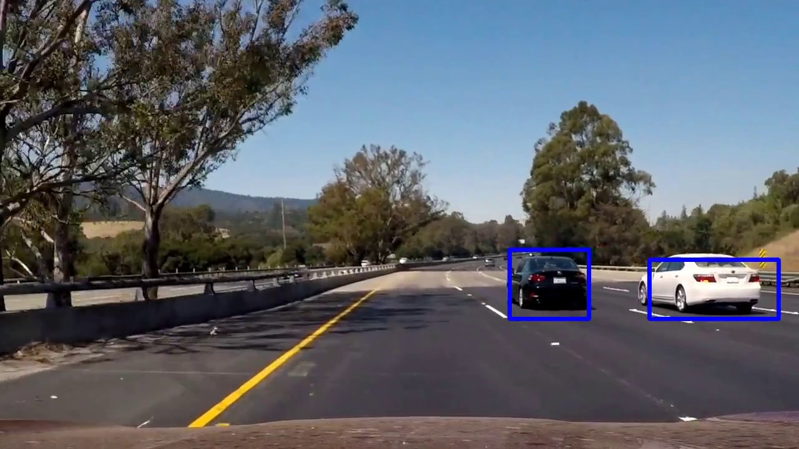

# Self-Driving Car Project: Vehicle Detection and Tracking

Hello there! I'm Babak. Let me introduce you to my project. In this project, I wrote a software pipeline to detect and track vehicles in a video. Using different training dataset and features to train the classifier; this algorithm can be used to detect and teack other objects such as pedestrains or cyclists. This project was written using Python object oriented programming.

### Pipeline:

The goals / steps of this project are the following:

* Perform a Histogram of Oriented Gradients (HOG) feature extraction on a labeled training set of images 
* Train a Linear Support Vector Machine (SVM) classifier on the HOG features. 
* Implement a sliding-window technique and use the trained classifier to search for vehicles in images.
* Run the pipeline on a video stream and create a heat map of recurring detections frame by frame to reject outliers and follow detected vehicles.
* Estimate a bounding box for vehicles detected.

### The Dataset

For this project, I used a labeled dataset of vehicles and non-vehicles to train my classifier. The data consists of a combination of 64x64 pixels images (8792 vehicles and 8968 non-vehicles) from GTI vehicle image database and KITTI vision benchmark suite. You can see a random selection of the dataset below:

Cars:

Not cars:

You can find the links to database here:

-[GTI vehicle image database](http://www.gti.ssr.upm.es/data/Vehicle_database.html)

-[KITTI vision benchmark suite](http://www.cvlibs.net/datasets/kitti/)

---
### Pipeline (image)

#### 1. Histogram of Oriented Gradients (HOG)

Histogram of oriented gradients divides the image into several sections and calculates the distribution (histograms) of the direction of oriented gradients ( x and y derivatives ) to be used as features. Gradients of an image are useful because the magnitude of gradients is large around edges and corners ( regions of abrupt intensity changes ) and we know that edges and corners pack in a lot more information about object shape than flat regions. In this step, I started by reading in all the vehicle and non-vehicle images. The examples of each of the vehicle and non-vehicle classes are shown in the dataset above. I then explored different color spaces and different skimage.hog() parameters (orientations, pixels_per_cell, and cells_per_block). I grabbed random images from each of the two classes and displayed them to get a feel for what the skimage.hog() output looks like. I tried various combinations of parameters and concluded that the lower pixels per cell and the higher cells per block the better but make the computation slower and more expensive. The values 8 and 2 seem to give good middle ground.

Here is an example using the RGB color space and HOG parameters of orientations=9, pixels per cell=(8, 8) and cells per block=(2, 2):

#### 2. SVM Classification

I trained a support vector machine (SVM) classifier using the selected HOG features. I trained a linear SVM using the following parameters: 

- Color space = YCrCb
- HOG channels = All
- Orientations = 9 
- Pixels per cell = 8
- Cells per block = 2
- Feature vector length = 5292

Which gives a test Accuracy of SVM =  %97.61. The predictions and labels for ten random data are:

SVM predicts:  [ 1.  1.  1.  0.  1.  0.  0.  1.  1.  0.]

Actual labels:  [ 1.  1.  1.  0.  1.  0.  0.  1.  1.  0.]

The classifier and the scaler are saved using pickle so we can use them later in the sliding window search and image/video processing.

#### 3. Sliding Window Search

Next, I implemented a sliding window search. I decided to search random window positions at random scales all over the image and came up with this. Finally I searched on two scales using YCrCb 3-channel HOG features in the feature vector, which provided a good result. Here are some example images:

#### 4. Heatmap

---

### Pipeline (video)

#### 1. Final video output 

Here's a [link to my video result](./project_video_output.mp4) 

---

### Discussion on making the pipeline more robust?